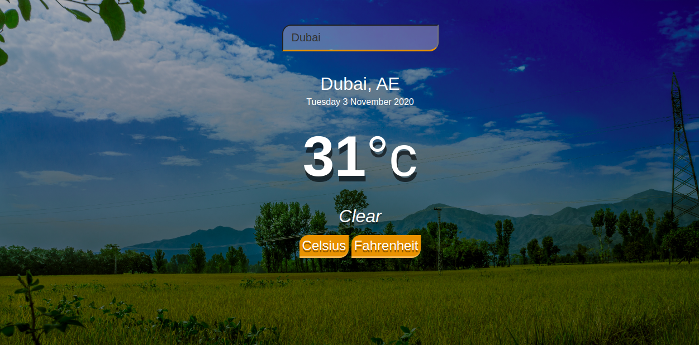

# Weather_app

Build a weather forecast site using the weather API.
# Project Specification

1. Set up a blank HTML document with the appropriate links to your JavaScript and CSS files.
2. Write the functions that hit the API. You’re going to want functions that can take a location and return the weather data for that location. For now, just console.log() the information.
3. Write the functions that process the JSON data you’re getting from the API and return an object with only the data you require for your app.
4. Set up a simple form that will let users input their location and will fetch the weather info (still just console.log() it).
5. Display the information on your webpage!
6. Add any styling you like!
7. Optional: add a ‘loading’ component that displays from the time the form is submitted until the information comes back from the API.

## Built With

- HTML5
- CSS
- Bootstrap
- Javascript ES6
- webpack
- API

## screenshots

### Index Page

## Getting Started

To get a local copy up and running follow these steps:

### Prerequisites

- Chrome
- Javascript enabled

### Usage

- Fork/Clone this project to your local machine with the command `git clone https://github.com/tGodson/Weather_app.git`.
- Open folder in your local enviroment.
- Double click on index.html file which is in the dist folder to view the site on your brouwser.
- To view in IDE just open project folder in your prefered IDE

## Author

👤 **Tendongze Godson**

- Github: [tGodson](https://github.com/tGodson)
- Twitter: [@tendongze95](https://twitter.com/tendongze95)
- Linkedin: [linkedin](https://www.linkedin.com/in/tendongzegodson)

## 🤝 Contributing

Contributions and feature requests are welcome!

Start by:

- Forking the project
- Clone the project to your local machine by running `git clone https://github.com/tGodson/Weather_app.git`
- `cd` into the project directory
- Run `git checkout -b your-branch-name`
- Make your contributions
- Push your branch up to your forked repository
- Open a Pull Request with a detailed description to the development(or master if not available) branch of the original project for a review

## Show your support

Give a ⭐️ if you like this project!

## Acknowledgments
Microverse
